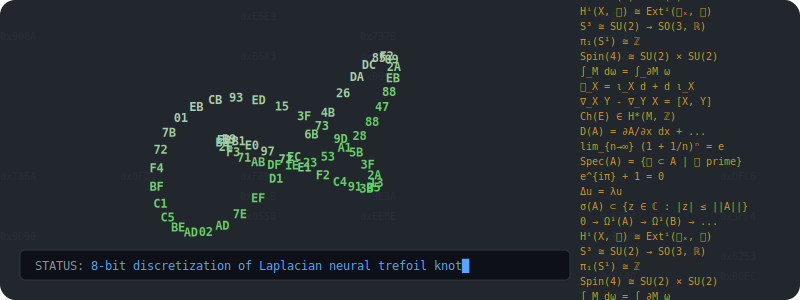

### 👨‍💻 Interests
#### Maths
Algebraic Geometry, Algebraic Topology, Probability, Numerical Analysis,
Differential Geometry, Machine Learning.
#### Computing
C/C++, Assembly Code, HTML/CSS/JS/SVG, Quarto, R, Python, paleocomputing
(FORTRAN, IBM 360/370, PL/I, ...).

---
### 📚 Lecture Notes

- <a href="https://mth4600.crystalmath.org" target="_blank">MTH4600 Applied Probability and Statistics</a>
- <a href="https://mth6139.crystalmath.org" target="_blank">MTH6139 Time Series Analysis</a>

---
### 🛠️ Open Source Utilities
To be released on GitHub soon.

#### Quarto music extension.
- Renders an abc notation code-block into as a musical score (SVG), and/or
  audio rendering (WEBM). abc code-blocks can be displayed or hidden.
- Extra features: caching of outputs, KATE syntax highlighting for abc
  notation, professional sound rendering using *Timbres of Heaven* soundfont.
- Possible use cases: music lecture notes, music theory lessons, music sheets
  (with audio if needed), abc coding lecture notes.
- Developed on Linux tool-chain (abcm2ps, abcmidi, fluidsynth, ffmpeg), might be
  possible to adapt to Windows or MacOS.

#### Quarto language extension.
- Takes user input in a code-block executes it, and renders results
  (assembling, compiling, linking and emulating as needed). Code can be
  displayed or hidden in quarto document.
- Current coverage: C++, Haskell, Rust, Lua, Pascal, PL/I, Algol, FORTRAN,
  COBOL, x86 Assembly. ARM Assembly, RISC-V Assembly, Lua, Go, Node.Js, and
  Kotlin, IBM 390 Assembly.
- Also supports GNUPLOT code blocks for rendering plots (as SVG) and Manim code
  (rendered as animated GIF).
- Extra features: caching of outputs, KATE syntax highlighting when not
  natively supported, vertical guidelines for fixed format languages (e.g.,
  FORTRAN and COBOL, 390 IBM Assembly).
- Possible use cases: lecture notes, technical blogs, documentation.
- Developed on Linux tool-chain, might be possible to adapt to Windows or
  MacOS.

---

 

> [!NOTE]
> In fact typing is connected to several areas:
>
> 1. **In Physics**, the 'type' of a quantity is its units; 10 metres cannot be
>    added to 5 seconds.
> 2. In C++ you can enforce this at compile-time:
>    - Create a class `metres` that contains a single `double` and overload
>      operators so only `metres` can be added to `metres`.
>    - Create a class `seconds` so that adding `metres` to `seconds` causes a
>      **compile-time error**👍.
>    - Defining `metresPerSecond` and its operations suitably, allows to divide
>      5 `metres` by 2 `seconds` to yield `metresPerSecond` object, and
>      `metresPerSecond * seconds` returns `metres`.
>    - The NASA Mars Climate Orbiter was lost in 1999 because one piece of
>      software used Newtons whereas another used old imperial units
>      (pounds-force). Should have strongly typed this.
>    - Note that there is no overhead at runtime as the compiler will create
>      identical machine code with or without typing.
> 3. In **Bourbaki style mathematics**, (amongst other things) one avoids
>    identifying everything, and their dog, with $\mathbb{R}^n$. A vector is a
>    different type of object from a point in space, or a covector. They cannot
>    be added, but a vector plus a point yields a point; and a covector times a
>    vector yields a number (and a vector times a covector yields an
>    endomorphism🤔).
> 4. In **group theory** one considers how groups act on other entities. In our case
>    rescaling units correspond to the action of the multiplicative group $\mathbb{R}^+$.
>    If we consider lengths and times, then the group $\mathbb{R}^+\times\mathbb{R}^+$
>    acts on our quantities by rescaling lengths and times.
>
>    If there were given "god-given" units for length and time (e.g. metres and
>    seconds), then the elements of the group $\mathbb{R}^+\times\mathbb{R}^+$
>    would correspond to rescaled units, e.g. $(1/1000, 1/3600)$ would mean
>    kilometres and hours. And one $m/s^2$ would become
>    $(1/1000)/(1/3600)^2=12960$ $km/h^2$.
>
>    As we do not have god-given units. We can only say that $m/s^2$ are
>    quantities that get multiplied by $t_L/t_T^2$ when lengths are rescaled by
>    $t_L$ and times by $t_T$. This, expression $\chi(t_L, t_T)=t_L/t_T^2$ is
>    called a character of the group $\mathbb{R}^+\times\mathbb{R}^+$, and the
>    different possible units correspond to the different characters of this
>    group.
>
>    Things get more fun when you allow rescaling of the whole space-time.

   

