### 👨‍💻 Interests
- Maths: algebraic geometry, algebraic topology, probability, numerical analysis,  differential geometry.
- Computing: C/C++, assembly code, HTML/CSS/JS, quarto, R, Python.

---
### 📚 Lecture Notes
Source code is private. Let me know of any feedback.

| Course | Site |
| :--- | :--- | :--- | :--- |
- [MTH4600 Applied Probability and Statistics](https://mth4600.crystalmath.org)
- [MTH6139 Time Series Analysis](https://mth6139.crystalmath.org)

---
### 🛠️ Open Source Utilities
To be released on GitHub.

- Quarto music extension.
    - Converts user input in the form of an abc notation code block into a
      rendered musical score, and/or quality audio rendering. abc Code block can be
      displayed or hidden.
    - Extra features: caching of outputs, KATE syntax highlighting for abc notation.
    - Possible use cases: music theory notes, music blogs, music sheets for
      educational purposes.

- Quarto language extension.
  - Takes user input in a code block executes is and renders results
    (performing assembling, compilation and linking in the background if
    needed). Code can be displayed or hidden in quarto document.
  - Current coverage: C++, Haskell, Rust, Lua, Pascal, PL/I, Algol, FORTRAN, COBOL, x86 Assembly.
    ARM Assembly, RISC-V Assembly, Lua, Go, Node.Js, and Kotlin.
  - Also supports GNUPLOT code blocks for rendering plots (as SVG) and Manim
    code (rendered as animated GIF).
  - Extra features: caching of outputs, KATE syntax highlighting when not
    natively supported, vertical guidelines for fixed format (e.g., FORTRAN and
    COBOL).
  - Possible use cases: educational notes, technical blogs, documentation.

---

 
<i>"Approximating the orbifold, one byte at a time."</i>

